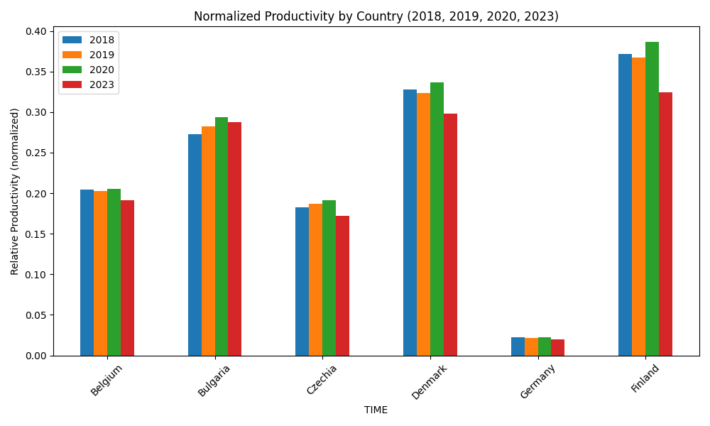

# ProductivityCalculations
POC to calculate Countries manufacturing productivities / graphics using EU data (https://ec.europa.eu/eurostat)


Using EU Gross value and Employment files from:

https://ec.europa.eu/eurostat/databrowser/view/nama_10_a10__custom_20421522/default/table
https://ec.europa.eu/eurostat/databrowser/view/nama_10_a10_e/default/table?lang=en&category=na10.nama10.nama_10_e_p


*browser.py defines*

```
wanted_countries = ["Belgium", "Bulgaria", "Czechia", "Denmark", "Germany","Finland"]
wanted_years = ["2018", "2019","2020","2023"]
```

*brower.py produces* 

```
----------------- PRODUCTIVITY (normalized) ---------------------------
        TIME      2018      2019      2020      2023
7    Belgium  0.203974  0.203094  0.205124  0.191052
8   Bulgaria  0.272719  0.282389  0.293588   0.28724
9    Czechia  0.182733  0.186868  0.191306  0.172088
10   Denmark  0.327621  0.323725  0.336604  0.297924
11   Germany  0.022283  0.021912  0.022239   0.01996
32   Finland  0.371715  0.366924    0.3861  0.324036


```





*Execute command*

```
python3 browser.py
```